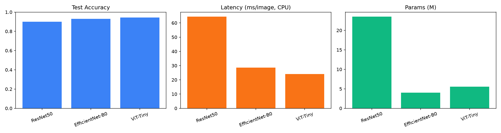
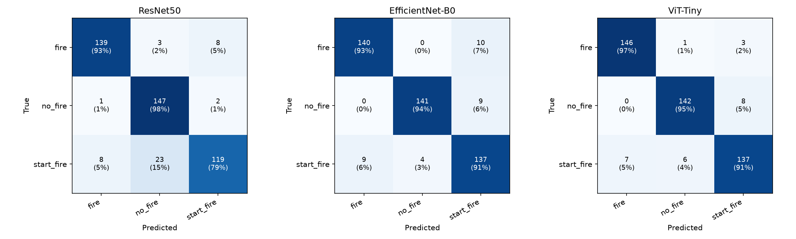
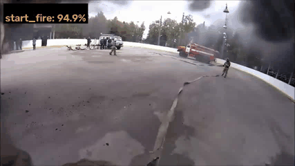

# Wildfire Backbone Benchmark

A controlled benchmark comparing three CNN/ViT backbones — ResNet50, EfficientNet-B0, and
ViT-Tiny/16 — for wildfire image classification (`fire` / `no_fire` / `start_fire`), designed
for a fair, apples-to-apples comparison: identical stratified train/val/test split across all
models, frozen-backbone linear probing, and a held-out test set touched only once per model.

Beyond accuracy, each model is scored on inference latency and parameter count to surface real
deployment tradeoffs, not just leaderboard numbers. Evaluation includes automated **hard-example
mining** — misclassified and low-confidence test images are saved per class, enabling a concrete
error analysis of the dataset's known weak point (`start_fire`, where smoke-only frames are
easily confused with `no_fire`) rather than just reporting an F1 number. The best-performing
model is deployed on a short video clip via a frame-sampling inference pipeline that overlays
live predictions, demonstrating the model beyond static test-set metrics.

This project is a differentiated build on the same idea as
[Skar0/fire-detection](https://github.com/Skar0/fire-detection): instead of one InceptionV3
model, it benchmarks three modern backbones head-to-head, and it turns error analysis and video
demo into first-class deliverables rather than an afterthought.

## Dataset

The reference project's own `fire` / `no_fire` / `start_fire` dataset (~6,000 images) was never
publicly released — no download link exists anywhere in its repo or docs. This benchmark instead
uses the [DeepQuestAI Fire-Smoke-Dataset](https://github.com/DeepQuestAI/Fire-Smoke-Dataset)
(3,000 real photos, CC-licensed, downloaded directly from its GitHub release — no account or API
key needed), mapped 1:1 onto the same three classes:

| DeepQuestAI class | Mapped to | Rationale |
|---|---|---|
| `Fire` | `fire` | Visible flame |
| `Neutral` | `no_fire` | No fire/smoke indicators |
| `Smoke` | `start_fire` | Smoke-only, pre-flame — the same "early onset" concept the reference project calls `start_fire` |

1,000 images/class, balanced. `data/prepare_split.py` builds one **stratified 70/15/15
train/val/test split** (seed 42), saved to `data/split.json` and reused identically by all three
training runs so the comparison is apples-to-apples.

## Backbone substitution: ViT-Tiny instead of DeiT-Tiny

The original plan called for `deit_tiny_patch16_224`. This sandboxed build environment's network
egress policy blocks `huggingface.co` and `dl.fbaipublicfiles.com` (where `timm` hosts DeiT's
ImageNet weights) but allows `github.com` and `storage.googleapis.com`. `timm`'s own older
checkpoint URLs for ResNet50 and EfficientNet-B0 still live on GitHub Releases, and Google's
official AugReg ViT-Tiny/16 weights live on GCS — all reachable. `models/build_model.py` forces
`timm` to use those non-Hub URLs instead of failing on the blocked Hub download. DeiT-Tiny was
swapped for **`vit_tiny_patch16_224`** (AugReg-in21k, fine-tuned on ImageNet-1k) — same ViT-Tiny/16
architecture family, ~5.5M params, functionally the equivalent comparison point.

## Results

*(Test set, n=450, 150/class. Frozen-backbone linear probe, 6 epochs, AdamW lr=1e-3, batch 32.
CPU-only training — no GPU was available in this build environment; see the note below on latency.)*

| Model | Test Acc | F1 (start_fire) | Latency (ms, CPU) | Params (M) | Hard Examples |
|---|---|---|---|---|---|
| ResNet50 | 0.900 | 0.853 | 64.4 | 23.5 | 64 |
| EfficientNet-B0 | 0.929 | 0.895 | 28.7 | 4.0 | 33 |
| **ViT-Tiny** | **0.944** | **0.919** | **24.1** | 5.5 | 26 |

ViT-Tiny wins on every axis here: highest accuracy, best `start_fire` F1, *and* lowest latency —
despite EfficientNet-B0 having fewer parameters, ViT-Tiny's patch-embedding forward pass is
cheaper per-image on CPU than EfficientNet-B0's depthwise convs. ResNet50 is both the slowest and
least accurate of the three, making it the clear loser of this comparison for this task. Latency
numbers are CPU (no GPU in this build environment); relative ordering, not absolute ms, is what's
transferable — on GPU all three would be faster in roughly the same rank order.




## Hard-example analysis

`start_fire` is the weakest class for every single model (F1 0.85–0.92, vs. 0.91–0.96 for `fire`
and `no_fire`) and produces the most hard examples in every run (26–64, vs. single digits to
low-teens for the other two classes on the better models). The confusion matrices point at one
specific, dominant failure mode: **`start_fire` mistaken for `no_fire`** — ResNet50 gets this
wrong on 23/150 (15%) of true `start_fire` test images, EfficientNet-B0 on 9%, ViT-Tiny on 6%.
This is exactly the ambiguity the project set out to measure, not a labeling artifact — pulling
actual images from `results/hard_examples/*/start_fire/` confirms it:

- **Faint or backgrounded smoke reads as `no_fire`.** A street scene with hazy exhaust/dust near a
  parked truck, and a shot of workers paving a road (heat shimmer + steam off hot asphalt), both
  get called `no_fire` — the smoke/haze signal is present but small, diffuse, or embedded in a busy
  scene rather than being the visual subject.
- **Sunset-tinted industrial steam reads as `fire`.** A row of factory smokestacks venting steam
  lit orange-pink by a sunset gets predicted `fire` with near-zero confidence in the true
  `start_fire` label — the model appears to be keying on warm color statistics more than smoke
  shape, and gets fooled by lighting that happens to mimic flame color.
- **Some `start_fire`-labeled source images aren't actually pre-flame.** One hard example under
  `start_fire` shows a fully burnt-out structure with firefighters on scene — visually an aftermath
  shot, not "early onset" smoke. This is dataset-definition noise inherited from the source data's
  own labeling, not a pure model failure, and it's worth knowing about if this dataset mapping is
  reused elsewhere.
- **A few `fire` hard examples are stylized illustrations, not photos** (e.g. a sepia painting of a
  battle scene with fire in the background) — out-of-distribution for an ImageNet-pretrained
  backbone, and a reminder that a handful of the source dataset's images aren't real photographs.

Net takeaway: the models aren't confusing `fire` with `no_fire` (that boundary is close to solved,
≥93% on the diagonal for all three) — the real difficulty, and the one worth spending future
labeling/augmentation effort on, is teaching the models to treat *any* smoke signal, however faint
or oddly lit, as a `start_fire` cue rather than defaulting to `no_fire` when flame isn't visible.

## Video demo

`infer_video.py` was run with the winning ViT-Tiny checkpoint on a short public wildfire-response
clip ([source](https://github.com/spacewalk01/yolov5-fire-detection), used here for demonstration
only), re-running inference every 12 frames and holding the last prediction between samples:



*(Full-resolution output: `results/videos/annotated.mp4`.)*

The clip itself is a good qualitative stress test of the exact `start_fire`/`fire` boundary the
hard-example analysis flags: early in the clip, with the car mostly obscured by dense black smoke
and only edges of flame visible, the model alternates between `start_fire` (correct-ish — smoke
dominates the frame) and `no_fire` (wrong — a frame where the flame is partly visible but the smoke
plume fills most of the frame). Once the camera closes in and the burning car fills the frame with
clearly-visible flame and little smoke, the model locks onto `fire` at 99%+ confidence. In other
words, the model is reliable when flame is large and unoccluded in-frame, and least reliable
exactly when smoke dominates the frame composition — which is the same failure mode the static
hard-example mining surfaced independently.

## Project structure

```
wildfire-backbone-benchmark/
├── README.md
├── requirements.txt
├── configs/config.yaml
├── data/
│   ├── prepare_split.py         # stratified train/val/test split
│   └── dataset.py                # PyTorch Dataset class
├── models/build_model.py         # loads any timm backbone w/ custom head
├── train.py                      # trains one backbone, saves checkpoint
├── evaluate.py                   # metrics + confusion matrix + latency + hard-example mining
├── infer_video.py                # annotates an mp4 with the best model's predictions
├── compare_results.py            # aggregates all 3 models into one table/plot
├── notebooks/colab_runner.ipynb  # orchestrates everything on Colab GPU
├── results/
│   ├── checkpoints/               # .pt files per model (gitignored, regenerate via train.py)
│   ├── metrics/                   # per-model JSON metrics + comparison.csv
│   ├── hard_examples/             # misclassified images per model, per class (gitignored)
│   ├── videos/                    # annotated demo video
│   └── plots/                     # confusion matrices, comparison charts
└── detection/                     # stretch goal, not run in this build (no bbox dataset available)
    ├── prepare_dfire.py
    └── train_yolo.py
```

## Reproducing

```bash
pip install -r requirements.txt

# 1. Populate data/raw/{fire,no_fire,start_fire}/ with your images, then:
python data/prepare_split.py

# 2. Train each backbone (checkpoints saved to results/checkpoints/)
python train.py --backbone resnet50 --epochs 6
python train.py --backbone efficientnet_b0 --epochs 6
python train.py --backbone vit_tiny_patch16_224 --epochs 6

# 3. Evaluate all three (metrics, confusion matrices, latency, hard-example mining)
python evaluate.py

# 4. Aggregate into a comparison table + plots
python compare_results.py

# 5. Annotate a demo video with the winning backbone
python infer_video.py --backbone <winner> --input clip.mp4 --output results/videos/annotated.mp4
```

On Colab: `Runtime → Change runtime type → T4 GPU`, then run `notebooks/colab_runner.ipynb` top
to bottom.

## Stretch goal: detection

`detection/prepare_dfire.py` and `detection/train_yolo.py` scaffold a YOLOv8n bounding-box
detector on the D-Fire dataset, following the same idea as the reference project's leap from
classification to detection. Not run in this build — no bounding-box dataset was available in
this environment — but the scripts are ready to point at a downloaded copy of D-Fire.
